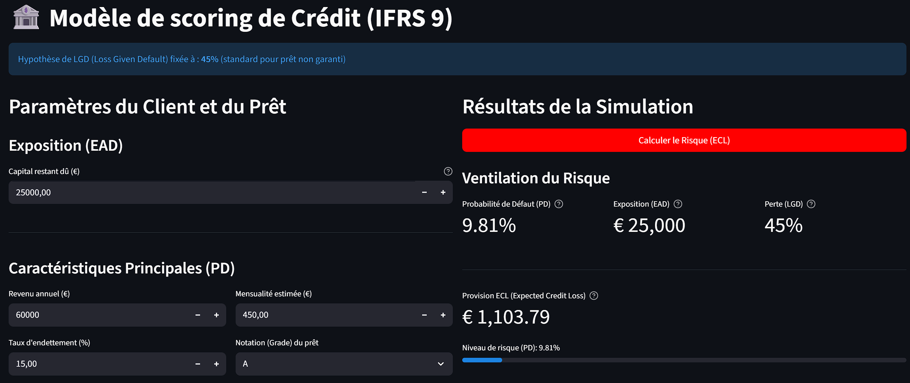

# 📊 Modele de Scoring (PD) & Dashboard ECL (IFRS 9)

Ce projet est une simulation complète d'un moteur de risque de crédit. Il entraîne un modèle de **Probabilité de Défaut (PD)** et le déploie dans un dashboard **Streamlit** interactif pour simuler le calcul de l'**Expected Credit Loss (ECL)** selon la norme IFRS 9.

Ce projet démontre les meilleures pratiques en MLOps, de la gestion des dépendances avec `Poetry` à la conteneurisation avec `Docker`.



## ✨ Fonctionnalités

* **Modélisation de la PD :** Entraînement d'un pipeline `Scikit-learn` pour prédire la probabilité de défaut.
* **Calcul d'ECL (IFRS 9) :** Simulation en temps réel de la formule `ECL = PD * LGD * EAD`.
* **Dashboard Interactif :** Une application `Streamlit` permettant à un analyste de saisir les informations d'un client et d'obtenir une simulation de risque instantanée.
* **Gestion des Dépendances :** Environnement reproductible garanti par `Poetry`.
* **Prêt pour la Production :** L'application est entièrement conteneurisée avec `Docker`.

## 🛠️ Stack Technique

* **Analyse & Modélisation :** `Pandas`, `Numpy`, `Scikit-learn`
* **Gestion des Dépendances :** `Poetry`
* **Application Web :** `Streamlit`
* **Déploiement :** `Docker`

---
---

## 🚀 Lancement Rapide (Local - Recommandé)

Cette méthode est la plus simple pour tester et développer l'application localement.

### 1. Prérequis

* [Python 3.13+](https://www.python.org/)
* [Poetry](https://python-poetry.org/docs/#installation)

### 2. Installation

```bash
# 1. Cloner le dépôt
git clone [https://github.com/VOTRE_NOM_UTILISATEUR_GITHUB/scoring_ifrs9.git](https://github.com/VOTRE_NOM_UTILISATEUR_GITHUB/scoring_ifrs9.git)

# 2. Se déplacer dans le dossier
cd scoring_ifrs9

# 3. Installer les dépendances
poetry install


## 📊 Données et Sélection des Variables

Ce projet utilise un jeu de données de prêts pour modéliser le risque de défaut. Les variables clés utilisées pour l'entraînement du modèle (les *features*) sont les suivantes :

### Features d'Entrée (Inputs)

| Variable | Définition |
| :--- | :--- |
| `term` | Nombre de paiements du prêt (36 ou 60 mois). |
| `int_rate` | Taux d'intérêt sur le prêt. |
| `installment` | Paiement mensuel estimé. |
| `grade` | Note de prêt attribuée par Lending Club. |
| `emp_length` | Ancienneté professionnelle (ex: '2 years', '10+ years'). |
| `home_onwership` | Statut de propriété du logement (ex: RENT, OWN, MORTGAGE). |
| `annual_inc` | Revenu annuel déclaré par l'emprunteur. |
| `dti` | Taux d'endettement (remboursements / revenu mensuel). |
| `tot_cur_bal` | Somme de tous les soldes impayés. |
| `open_acc_6m` | Nombre de comptes de crédit ouverts (6 derniers mois). |
| `total_bal_il` | Total des montants impayés restants. |
| `inq_fi` | Nombre de demandes de crédit (6 derniers mois). |
| `mort_acc` | Nombre de comptes hypothécaires actifs. |
| `num_sats` | Nombre de crédits jugés satisfaisants (sans retard). |

### Cible et Variables Exclues (Leakage)

Les variables suivantes sont des **résultats** du prêt et ne sont **pas** utilisées comme *features* pour entraîner le modèle de PD, afin d'éviter les fuites de données :

> * **`loan_status` (Cible Y) :** Statut du prêt (ex: Défaut / Payé). C'est la variable que nous cherchons à prédire.
> * **`out_prncp` (Utilisé pour EAD) :** Principal restant dû. C'est l'Exposition au Défaut, pas une feature.
> * **`total_pymnt` :** Montants bruts récupérés après mise en défaut.
> * **`recoveries` :** Total des paiements reçus à ce jour.

### Source

Les définitions complètes des variables ont été identifiées à partir de [cette référence RStudio](https://rstudio-pubs-static.s3.amazonaws.com/290261_676d9bb194ae4c9882f599e7c0a808f2.html).